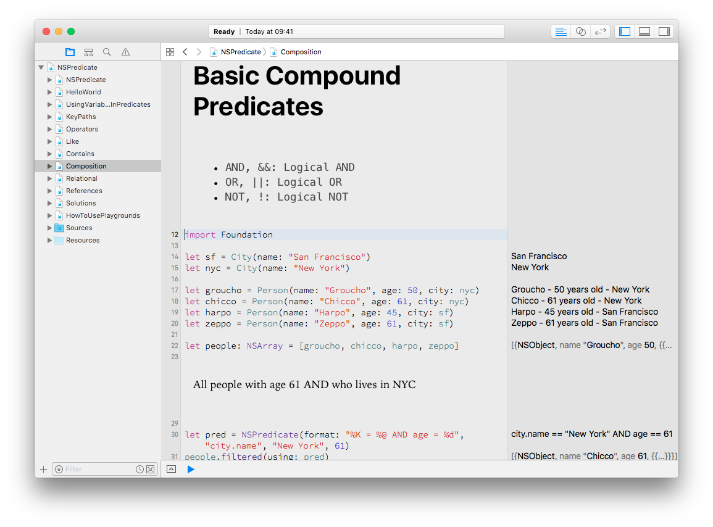

# NSPredicate in Swift 3 Playground

The NSPredicate class is used to define __logical conditions__ used to constrain a search either for a __fetch__ or for __in-memory__ filtering.

- when fetching objects, they arrive filtered from disk. This is used with [Core Data](https://developer.apple.com/library/mac/documentation/Cocoa/Conceptual/CoreData/cdProgrammingGuide.html)
- when the predicate is used in memory, we filter content of arrays

You use predicates to represent logical conditions.

We can create predicates from:
- instances of NSComparisonPredicate, NSCompoundPredicate, and NSExpression
- a format string which is parsed by the class methods on NSPredicate

We're going to focus on the second approach: NSPredicate then _feels like_ using SQL with your objects
 
 _Playground content authored by [Diego Freniche](https://github.com/dfreniche). License: MIT. Please, don't remove this notice_

## Contributing

- If you spot an error / typo / dead link / something missing, please file an issue.
- Pull requests are welcome ;-)

## LICENSE

MIT - Licence

Copyright (c) 2017 Diego Freniche

Permission is hereby granted, free of charge, to any person obtaining a copy of this software and associated documentation files (the "Software"), to deal in the Software without restriction, including without limitation the rights to use, copy, modify, merge, publish, distribute, sublicense, and/or sell copies of the Software, and to permit persons to whom the Software is furnished to do so, subject to the following conditions:

The above copyright notice and this permission notice shall be included in all copies or substantial portions of the Software.

THE SOFTWARE IS PROVIDED "AS IS", WITHOUT WARRANTY OF ANY KIND, EXPRESS OR IMPLIED, INCLUDING BUT NOT LIMITED TO THE WARRANTIES OF MERCHANTABILITY, FITNESS FOR A PARTICULAR PURPOSE AND NONINFRINGEMENT. IN NO EVENT SHALL THE AUTHORS OR COPYRIGHT HOLDERS BE LIABLE FOR ANY CLAIM, DAMAGES OR OTHER LIABILITY, WHETHER IN AN ACTION OF CONTRACT, TORT OR OTHERWISE, ARISING FROM, OUT OF OR IN CONNECTION WITH THE SOFTWARE OR THE USE OR OTHER DEALINGS IN THE SOFTWARE.
